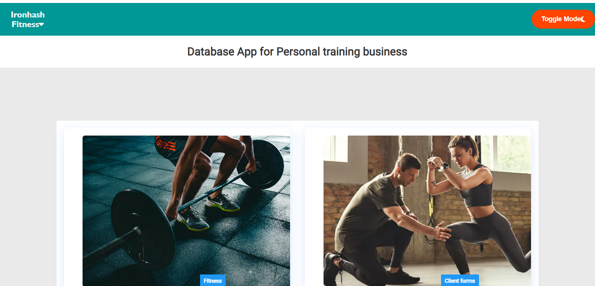

# IOD CAPSTONE PROJECT

> Project Name: Ironhash Fitness App

<a name="readme-top"></a>
<br />
<div align="center">
  <a href="https://github.com/othneildrew/Best-README-Template">
    
  </a>

  <h3 align="center">Overview</h3>

  <p align="center">
The Fitness App is a web application designed for personal trainer and clients. It provides features for user authentication, exercise tracking, client management, session scheduling, and fitness challenges.
    <br />
  </p>

</div>

<details>
  <summary>Table of Contents</summary>
  <ol>
    <li>
      <a href="#about-the-project">About The Project</a>
      <ul>
        <li><a href="#built-with">Built With</a></li>
      </ul>
    </li>
    <li>
      <a href="#getting-started">Getting Started</a>
      <ul>
        <li><a href="#prerequisites">Prerequisites</a></li>
        <li><a href="#installation">Installation</a></li>
      </ul>
    </li>
    <li><a href="#usage">Usage</a></li>
    <li><a href="#roadmap">Roadmap</a></li>
    <li><a href="#contributing">Contributing</a></li>
    <li><a href="#license">License</a></li>
    <li><a href="#contact">Contact</a></li>
    <li><a href="#acknowledgments">Acknowledgments</a></li>
  </ol>
</details>

## About The Project



We wanted to create a fitness App where individuals can manage their workout and nutrition plans. As we were working on this project we decided to create an App for Personal trainers to use to run their business with their clients more smoothly. 

The General Tasks so far are:

- Creating a workout plan for clients
- Adding new clients by creating profiles with their information and goals.
- Chat features to stay in touch with clients
- Book consultation and workout sessions with clients
- Create and Post fitness challenges for clients to participate in.

The App is in the very early stages. we plan to add more functionality as we up skill ourselves and plan to create the client UI where they have different access than their PT. The access will be controlled by the PT based on what services they pay for.

Use this README.md to get started.

<p align="right">(<a href="#readme-top">back to top</a>)</p>

## Built With

### Backend (Node.js):
#### Dependencies:
- `express`: A web application framework for Node.js.
- `cors`: Middleware for enabling Cross-Origin Resource Sharing.
- `dotenv`: Module for loading environment variables from a .env file.
- `multer`: Middleware for handling multipart/form-data, used for file uploads.
- `bcrypt`: Library for hashing passwords securely.
- `joi`: Library for data validation.
- `joi`-password-complexity: Plugin for defining password complexity rules.
- `jsonwebtoken`: Library for generating and verifying JSON Web Tokens.
- `mongoose`: MongoDB object modeling tool designed to work in an asynchronous environment.
- `nodemon`: Utility that monitors changes in the source code and automatically restarts the server.

#### Configuration:
The application requires a MongoDB database connection. Ensure the `dbConnect.js` file contains the necessary database configuration.
Environment variables are loaded using dotenv to configure the application. Create a `.env` file with appropriate variables like `PORT` for the server port.

#### Middleware:
`express.json()`: Middleware to parse incoming JSON requests.
`cors`: Middleware to enable Cross-Origin Resource Sharing.

### Frontend (React):
#### Dependencies:
- `react-router-dom`: Library for declarative routing in React applications.
- `@fortawesome/free-solid-svg-icons`: Library providing free solid icons.
- `@fortawesome/react-fontawesome`: Library for using Font Awesome icons in React.
- `@fullcalendar/daygrid`: FullCalendar plugin for displaying day grid views.
- `@fullcalendar/interaction`: FullCalendar plugin for interacting with events.
- `@fullcalendar/react`: React wrapper for the FullCalendar library.
- `@mui/icons-material`: Material-UI icons library.
- `@mui/material`: React components library following the Material Design guidelines.
- `axios`: Promise-based HTTP client for the browser and Node.js.
- `react`: JavaScript library for building user interfaces.
- `react-dom`: Entry point to the DOM and server renderers for React.
- `react-modal`: Accessible modal dialog component for React.
- `vitest`: Test runner for Vite projects.

#### Development Dependencies:
- `@types/react`: Type definitions for React.
- `@types/react-dom`: Type definitions for ReactDOM.
- `@vitejs/plugin-react`: Plugin for using React with Vite.
- `eslint`: JavaScript linter.
- `eslint-plugin-react`: ESLint plugin for React.
- `eslint-plugin-react-hooks`: ESLint plugin for React hooks.
- `eslint-plugin-react-refresh`: ESLint plugin for React Refresh.
- `vite`: Next-generation frontend tooling.

#### Usage:
- Start the backend server by running `npm start` in the root directory.
- Start the frontend development server by running `npm run dev` in the client directory.
- Access the application through the browser at `http://localhost:8080`.

<p align="right">(<a href="#readme-top">back to top</a>)</p>


## Getting Started

To get a local copy up and running follow these simple example steps.

### Prerequisites

1. `Node.js and npm`: Ensure you have Node.js installed on your machine. You can download and install it from the official Node.js website.
2. `MongoDB`: Install MongoDB on your system or use a cloud-based MongoDB service. You can download MongoDB from the official MongoDB website.
3. `Text Editor or IDE`: Choose a text editor or integrated development environment (IDE) for writing and editing code. Popular choices include Visual Studio Code, Sublime Text, or Atom.
4. `Git`: Install Git for version control. You can download Git from the official Git website.

### Installation

####  1.Clone the repo:
<br>
   Clone the repository for the Fitness App from the project's Git repository using the following command:
   <br>

   ```sh
   git clone https://github.com/institutedata/capstone-HashleyB.git
   ```

####  2.Install Dependencies:
- Navigate to the root directory of the project (backend) and the client directory (frontend) in separate terminal windows.
- Run the following command in each terminal window to install the required dependencies:

   ```sh
   npm install
   ```
####  3.Set Up Environment Variables:
- In the backend directory, create a `.env` file based on the provided `.env.example` file.
-Define the necessary environment variables such as `PORT`, `MONGODB_URI`, and any other configuration variables required for the application.

####  4.Start the Backend Server:
- In the backend directory, run the following command to start the backend server:

```sh
npm start
```
####  5.Start the Frontend Development Server:
In the client directory, run the following command to start the frontend development server:

```sh
npm run dev
```
#### 6.Access the Application:
Once both the backend and frontend servers are running, access the application through your web browser at `http://localhost:8080`.
#### 7.Register and Log In:
Use the provided authentication routes (/auth) to register a new user account and log in to the application.
#### 8.Explore the Features:
Once logged in, explore the various features of the Fitness App, including exercise tracking, client management, session scheduling, and fitness challenges.

By following these steps, you'll be able to set up and run the Fitness App locally on your machine, allowing you to explore its functionalities and start using it for yours or your clients' fitness goals.
<p align="right">(<a href="#readme-top">back to top</a>)</p>


## Usage

#### Landing page

- This is where you can login if you have already created your account. To login you need to type your email and password. If you don't have don't have an account, you can click on `Sign up here` button to create one.


#### Sign up page

- This is where you can create an account by entering your name, email and create a password.


#### Main page

 - Once you logged in, you'll be taken to the main page where you will have a drop menu with the following:
 1. `Home`: takes you back to the `main page`.
 2. `Profile`: shows the profile of the trainer logged in and the information their clients will see on their user interface.
 3. `Contact`: database where all your clients contacts are save for future use.
 4. `Logout`: logs you out and take you to a `logout successfully page`.

 - On the main page, you can access the following pages on the cards shown:
 1. `Fitness`: Create and manage workouts for clients.
 2. `Client forms`: Add new profiles for clients.
 3. `Chat`: Send message to clients via chat.
 3. `Planner`: Book and manage appointments.
 5. `Fitness challenges`: View and post challenges for your clients.


<p align="right">(<a href="#readme-top">back to top</a>)</p>

## Contact

#### Hashley Beedah
- `email`: hashleyb@outlook.com


<p align="right">(<a href="#readme-top">back to top</a>)</p>

## Acknowledgments

I want to thank my course lecturers from the Institute of Data for the amazing experience of learning software engineering in the past 6 months. Forever grateful for all the knowledge and help they have provided.

- #### Isaac
- #### Bally
- #### Keren

Thank you!

<p align="right">(<a href="#readme-top">back to top</a>)</p>

